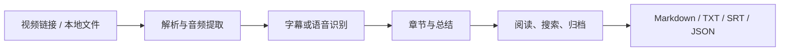

# V2Note

> 把视频里的知识变成可检索、可复用的文档。

V2Note 是一个通过浏览器使用的音视频整理工具。粘贴 B 站、YouTube、抖音等视频链接，或导入本地视频、音频和字幕，V2Note 会把内容转写、总结并整理成带章节和时间戳的文档，方便复核、搜索、归档和导出。

## 主要能力

- **多种输入**：单个视频链接、本地音视频、字幕文件，以及识别出的 B 站合集。
- **结构化阅读**：全文总结、章节原文、时间戳字幕和可选译文集中展示；点击原文或字幕句段即可定位视频时间。
- **内容管理**：在总结记录中搜索、筛选和批量选择，用合集整理长期保存的视频文档。
- **灵活导出**：按结果类型导出 Markdown、TXT、SRT、VTT、LRC、JSON 和可用的音频格式。
- **可替换模型**：按需配置云端或本地的语音识别、总结模型和提示词模板。

## 从视频到文档



每个阶段都可以单独查看结果。识别或总结失败时，已经生成的音频、字幕和文档仍会保留，方便定位问题和重试。

## 快速开始

### 环境要求

- Windows 10/11
- Conda
- Node.js 和 npm
- FFmpeg

Python、FFmpeg、CUDA 和 Python 包版本由 `environment.yml` 声明，前端依赖由 lockfile 管理。

### 安装与运行

```powershell
conda env create -f environment.yml
conda activate vtnote
python -m pip install -e ".[dev]"
npm --prefix frontend ci
npm --prefix frontend run build
vtnote
```

然后打开 <http://127.0.0.1:8766>。首次使用时，在页面中配置语音识别和 AI 模型；只做本地转写时，可以不配置总结模型。

默认服务只监听 `127.0.0.1`。本机模式的内容库、缓存、模型文件和导出结果保存在用户数据目录及 `exports/` 等位置，这些运行数据已被 Git 忽略。

## 输入与输出

### 输入

- B 站、YouTube、抖音等受支持的视频链接。
- 本地视频和音频文件。
- 本地字幕文件。
- B 站视频合集或批量任务。

### 输出

- 全文总结、章节和重点。
- 带时间戳的原文与字幕。
- Markdown、TXT、SRT、VTT、LRC、JSON 文件。
- 可用的音频文件。

## 技术架构

```text
React / TypeScript 前端
          │ HTTP
FastAPI API ── MySQL 阶段状态 ── Kafka ── 独立 Worker
       │             │                         │
       └────── Redis 来源幂等 ──────────────────┤
                                                 ├─ FFmpeg / 平台解析 / ASR
                                                 └─ LangGraph 章节总结
```

服务端运行使用 MySQL、Kafka 与 Redis；本地桌面运行仍使用 SQLite 和独立 Worker。视频任务由 Worker 消费 Kafka 阶段消息，MySQL 保存阶段状态与恢复进度；重复来源通过 Redis 快速命中，并由 MySQL 映射保障结果复用。章节总结使用 LangGraph 推进分块游标，处理中断后从已保存的游标继续。

启动服务端依赖：复制 `.env.example` 为 `.env` 并设置独立随机密码，再启动 `docker compose -f docker-compose.server.yml up -d`。该 Compose 只提供本机开发依赖，所有端口都绑定回环地址；运行 V2Note 的当前 PowerShell 会话还需设置 `VTNOTE_DATABASE_URL`、`VTNOTE_KAFKA_BOOTSTRAP_SERVERS` 和 `VTNOTE_REDIS_URL`，然后用常规启动命令启动应用。数据库密码放入 URL 时需进行 URL 编码。

- `src/vtnote/`：启动器、API、Worker、任务流水线和资源解析。
- `src/vtnote/http/`：HTTP 路由、请求参数和响应结构。
- `src/vtnote/application/`：跨入口复用的应用层规则。
- `frontend/src/pages/`：页面编排和路由级数据加载。
- `frontend/src/features/`：任务创建、内容库、合集、结果阅读等业务模块。
- `frontend/src/components/`：弹窗、搜索、下拉菜单等通用组件。
- `frontend/src/styles/`：全局令牌、组件样式和功能样式。
- `tests/`：Python 单元、集成、架构和离线端到端测试。
- `docs/`：安装、产品、技术决策和发布文档。

前端页面复用统一的弹窗、菜单、选择控件、动效和设计令牌。API 与 Worker 通过耐久任务合同和文件产物协作，任务可以在进程重启后恢复。

## 模型配置

V2Note 不把模型文件提交到仓库。用户可以在设置中选择云端服务，或按需安装本地 ASR 资产；当前代码包含 SenseVoice Small INT8（sherpa-onnx + Silero VAD）和 Faster-Whisper 的适配入口。模型清单位于 `assets/models/`，实际模型文件保存在被忽略的运行目录中。

## 测试与打包

应用测试默认使用本地夹具和隔离存储，不调用真实 ASR、AI 或视频平台服务。

```powershell
conda activate vtnote
python -m pytest -q
npm --prefix frontend test
npm --prefix frontend run lint
npm --prefix frontend run build
npm --prefix frontend run test:e2e:install
npm --prefix frontend run test:e2e
```

构建 wheel：

```powershell
conda activate vtnote
python tools/package.py
```

产物写入 `dist/`。打包脚本会检查生产页面、模型清单和内置验证音频是否完整，并拒绝包含个人 Windows 绝对路径的文本文件。

## 相关文档

- [安装与运维](docs/installation.md)
- [产品需求](docs/product-requirements.md)
- [技术决策](docs/technical-decisions.md)
- [发布检查清单](docs/release-checklist.md)
- [界面设计规范](design-system/vtnote/MASTER.md)

开发服务默认使用端口 `8766`。
